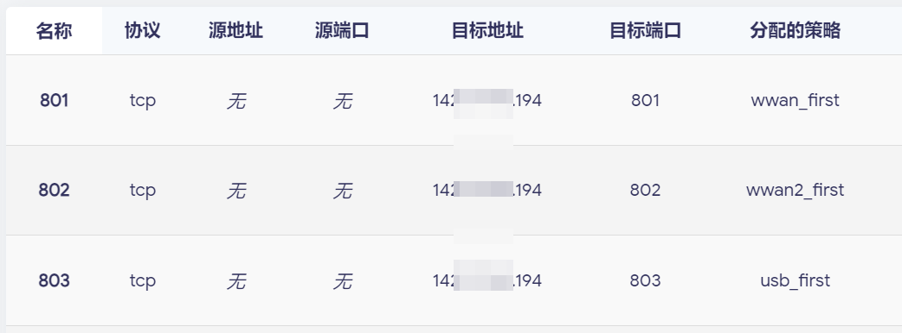
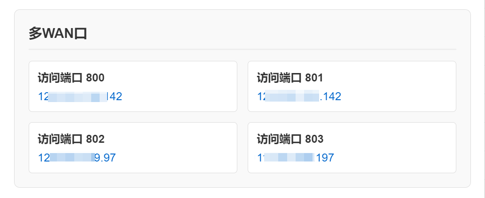

# MWAN3 MYIP

一个自用的轻量级多WAN口IP检测工具，同时支持IP侧漏检测功能。

考虑到普通人不会有许多独立IP的服务器，所以以多个端口区分出口流量，需同时在路由器 `MultiWAN 管理器 - 规则` 中设置好 `目标地址` `目标端口` 的分流。


|  MWAN3 规则 | 检测结果 |
| --- | --- |
|  |  |

## 部署

### Docker

```bash
# 基础运行（仅映射800端口）
docker run -d \
  -p 800:800 \
  -e CHECK_PORTS=800 \
  ghcr.io/cp0204/mwan3-myip:latest
```

```bash
# 完整运行（映射多个端口，几个WAN就使用几个端口）
docker run -d \
  -name mwan3-ip \
  -p 800:800 \
  -p 801:800 \
  -p 802:800 \
  -p 803:800 \
  -e CHECK_PORTS=800,801,802,803 \ # 需检测的端口
  ghcr.io/cp0204/mwan3-myip:latest
```

### Docker Compose部署

创建 `docker-compose.yml` 文件：

```yaml
name: mwan3-myip
services:
  mwan3-myip:
    image: ghcr.io/cp0204/mwan3-myip:latest
    container_name: mwan3-myip
    ports:
      - "800:800"
      - "801:800"
      - "802:800"
      - "803:800"
    environment:
      - CHECK_PORTS=800,801,802,803
    restart: unless-stopped
```

## 许可证

MIT License